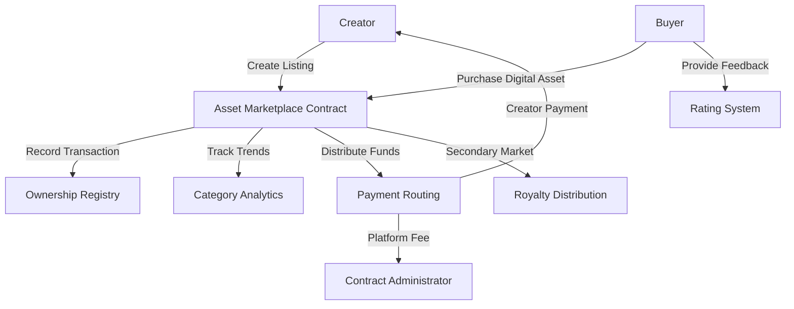

# SPL Digital Asset Marketplace

A decentralized platform for trading digital assets on the Stacks blockchain, empowering creators to tokenize, sell, and trade their digital works with secure ownership tracking and revenue sharing.

## Overview

SPL Marketplace is an innovative blockchain-powered platform built on Stacks that enables:
- Tokenization of digital assets (design templates, media, digital art)
- Flexible pricing and royalty mechanisms
- Transparent ownership tracking
- Creator-centric revenue model
- Secure and transparent transactions using STX

Key features:
- Programmable royalty structures
- Immutable ownership records
- Reputation and rating system
- Frictionless asset trading
- Built-in platform governance

## Architecture

The marketplace leverages a core smart contract to manage all marketplace operations:



### Core Components:
1. **Listing Management**: Digital asset registration and lifecycle
2. **Transaction Processing**: Secure, transparent asset transfers
3. **Ownership Tracking**: Comprehensive asset provenance
4. **Feedback Mechanism**: Creator reputation system
5. **Market Intelligence**: Category performance insights

## Contract Documentation

### SPL Asset Marketplace Contract

The primary contract (`spl-asset-marketplace.clar`) orchestrates all marketplace interactions.

#### Key Features

- **Asset Registration**
  - Create and manage digital asset listings
  - Define pricing and royalty parameters
  - Store comprehensive asset metadata

- **Transaction Handling**
  - Validate and execute secure purchases
  - Automatic fee and royalty distribution
  - Immutable ownership record creation

- **Reputation System**
  - Asset rating and review functionality
  - Single review per purchase limitation
  - Transparent feedback mechanism

#### Governance Principles
- Creator-exclusive listing modifications
- Buyer-limited review capabilities
- Transparent fee structures
- Configurable royalty caps

## Getting Started

### Prerequisites
- Clarinet development environment
- Stacks-compatible wallet
- STX tokens for transactions

### Basic Usage

1. **Creating a Digital Asset Listing**
```clarity
(contract-call? .spl-asset-marketplace create-digital-listing 
    "Professional Design Template"
    "Elegant UI/UX design for modern web applications"
    u1000000 ;; Price in µSTX
    "design-templates"
    "https://preview.example.com/template"
    "https://assets.example.com/full-template"
    u10 ;; 10% creator royalty
)
```

2. **Purchasing a Digital Asset**
```clarity
(contract-call? .spl-asset-marketplace purchase-digital-asset u1)
```

## Development

### Testing
1. Install Clarinet
2. Clone repository
3. Execute test suite:
```bash
clarinet test
```

### Local Deployment
1. Launch Clarinet console:
```bash
clarinet console
```

## Security Considerations

### Platform Limitations
- On-chain asset URL storage
- Block-height based time approximation
- Rating system with 5-point scale

### Risk Mitigation
- Validate asset ownership pre-resale
- Verify listing status before purchase
- Maintain STX balance for transaction fees
- Conduct thorough seller and asset due diligence

## License
[To be determined - Specify appropriate open-source license]